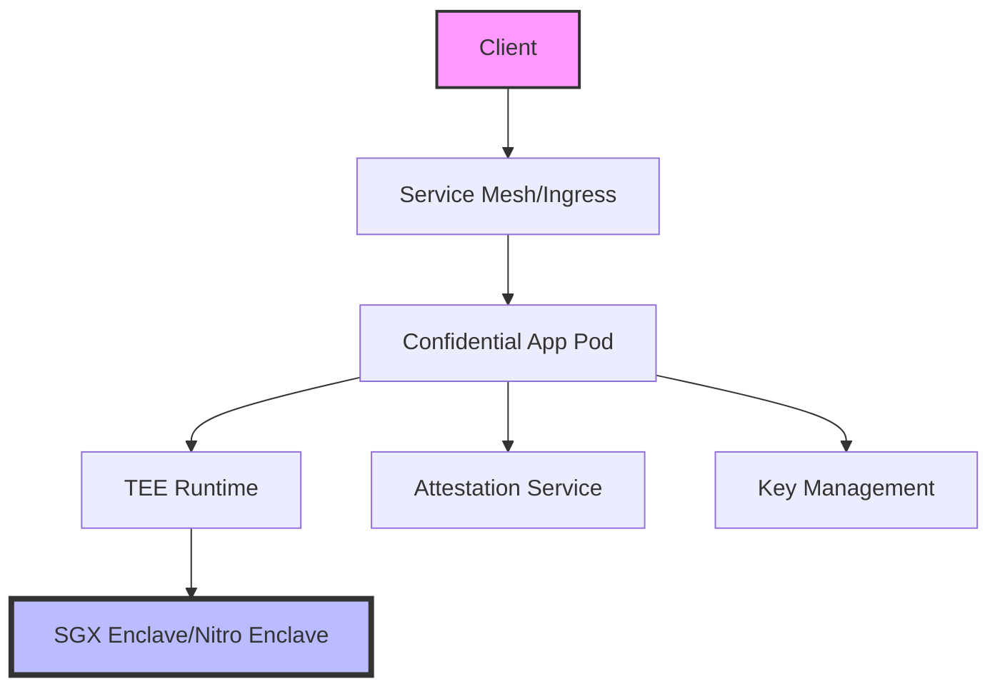

# Confidential Computing Helm Chart 🔐

<div align="center">

[](https://helm.sh)
[](LICENSE)
[](https://kubernetes.io)
[](https://github.com/yashodhan271/confidential-compute/stargazers)
[](https://github.com/yashodhan271/confidential-compute/network/members)


[Features](#-features) •
[Prerequisites](#-prerequisites) •
[Installation](#-quick-start) •
[Configuration](#%EF%B8%8F-configuration) •
[Security](#-security-best-practices) •
[Contributing](#-contributing)

</div>

> A production-ready Helm chart for deploying applications in confidential computing environments, supporting Intel SGX and AWS Nitro Enclaves.

## 🌟 Features

<table>
  <tr>
    <td>
      <h3>🛡️ Multi-Platform TEE Support</h3>
      <ul>
        <li>Intel Software Guard Extensions (SGX)</li>
        <li>AWS Nitro Enclaves</li>
        <li>Extensible for other TEE platforms</li>
      </ul>
    </td>
    <td>
      <h3>🔒 Advanced Security</h3>
      <ul>
        <li>Automated enclave provisioning</li>
        <li>Remote attestation services</li>
        <li>Memory encryption at runtime</li>
      </ul>
    </td>
  </tr>
  <tr>
    <td>
      <h3>⚙️ Enterprise Ready</h3>
      <ul>
        <li>High availability support</li>
        <li>Resource optimization</li>
        <li>Monitoring integration</li>
      </ul>
    </td>
    <td>
      <h3>📊 Observability</h3>
      <ul>
        <li>Prometheus metrics</li>
        <li>Grafana dashboards</li>
        <li>Custom TEE metrics</li>
      </ul>
    </td>
  </tr>
</table>

## 📋 Prerequisites

<details>
<summary>Click to expand prerequisites</summary>

### System Requirements
- Kubernetes cluster (v1.19+)
- Helm v3.0+
- kubectl CLI

### Platform-Specific Requirements

#### For Intel SGX:
- SGX-enabled nodes
- SGX device plugin
- Intel SGX DCAP driver
```bash
# Verify SGX support
sgx-detect
```

#### For AWS Nitro:
- AWS EC2 instances with Nitro support
- AWS CLI configured
- Required IAM permissions
```bash
# Verify Nitro Enclave support
nitro-cli --version
```
</details>

## 🚀 Quick Start

1. **Clone the repository:**
   ```bash
   git clone https://github.com/yashodhan271/confidential-compute.git
   cd confidential-compute
   ```

2. **Install the chart:**
   ```bash
   helm install my-secure-app . \
     --set confidentialComputing.platform=sgx \
     --namespace secure-apps \
     --create-namespace
   ```

3. **Verify the installation:**
   ```bash
   kubectl get pods -n secure-apps
   kubectl get events -n secure-apps
   ```

## 📊 Architecture



## ⚙️ Configuration

<details>
<summary>View configuration options</summary>

### Basic Configuration
```yaml
confidentialComputing:
  platform: "sgx"  # or "nitro"
  enabled: true
  
app:
  name: "secure-app"
  replicas: 3
```

### Full Configuration Reference

| Parameter | Description | Default |
|-----------|-------------|---------|
| `confidentialComputing.platform` | TEE platform (sgx/nitro) | `sgx` |
| `confidentialComputing.enabled` | Enable confidential computing | `true` |
| `app.name` | Application name | `secure-app` |
| `app.replicas` | Number of replicas | `1` |
| `security.encryption.enabled` | Enable encryption | `true` |
| `security.attestation.enabled` | Enable attestation | `true` |

</details>

## 🔒 Security Best Practices

<details>
<summary>View security recommendations</summary>

### 1. Image Security
- Use signed container images
- Implement vulnerability scanning
- Regular security updates

### 2. Network Security
- Enable network policies
- Use TLS for all communications
- Implement egress filtering

### 3. Access Control
- Use RBAC policies
- Implement least privilege principle
- Regular access audits

</details>

## 📈 Monitoring

The chart includes integration with popular monitoring tools:

<table>
  <tr>
    <td>
      <h4>📊 Metrics</h4>
      <ul>
        <li>Enclave status</li>
        <li>Memory usage</li>
        <li>Attestation metrics</li>
      </ul>
    </td>
    <td>
      <h4>📱 Dashboards</h4>
      <ul>
        <li>Grafana templates</li>
        <li>Custom panels</li>
        <li>Alert rules</li>
      </ul>
    </td>
  </tr>
</table>

## 🧪 Testing

```bash
# Run helm test
helm test my-secure-app

# Verify attestation
kubectl exec -it my-secure-app -- verify-attestation

# Check enclave status
kubectl exec -it my-secure-app -- sgx-status
```

## 🤝 Contributing

We welcome contributions! Here's how you can help:

1. Fork the repository
2. Create your feature branch: `git checkout -b feature/amazing-feature`
3. Commit your changes: `git commit -m 'feat: Add amazing feature'`
4. Push to the branch: `git push origin feature/amazing-feature`
5. Open a Pull Request

For major changes, please open an issue first to discuss what you would like to change.

## 📝 License

This project is licensed under the MIT License - see the [LICENSE](LICENSE) file for details.

## 🙌 Acknowledgments

- Intel SGX Team for their excellent documentation
- AWS Nitro Team for platform support
- Kubernetes SIG-Security for best practices
- Our amazing contributors

---

<div align="center">

⭐ Found this project useful? Please consider giving it a star!

Made with ❤️ for the Confidential Computing community

[Report Bug](https://github.com/yashodhan271/confidential-compute/issues) • [Request Feature](https://github.com/yashodhan271/confidential-compute/issues)

</div>
