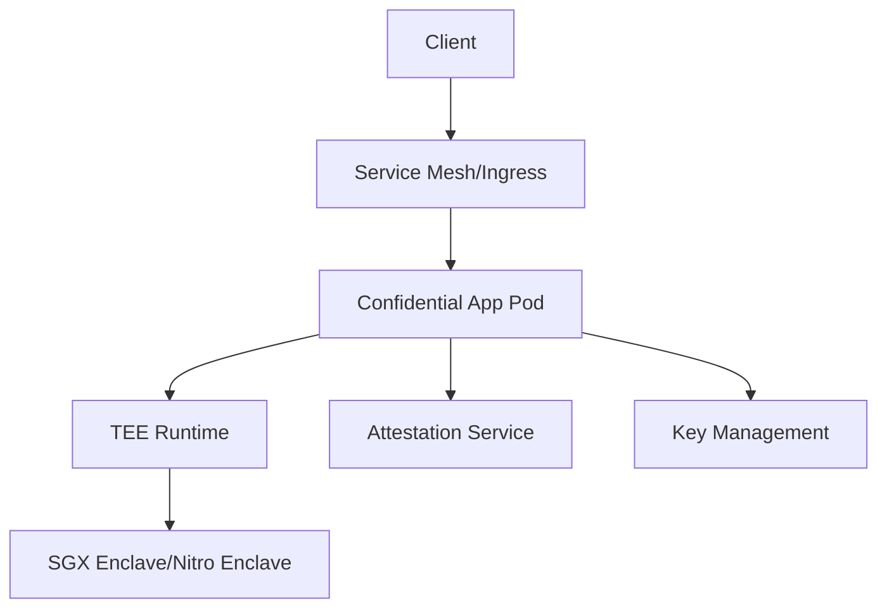

# Confidential Computing Helm Chart 🔐

[](https://helm.sh)
[](LICENSE)
[](https://kubernetes.io)

> A production-ready Helm chart for deploying applications in confidential computing environments, supporting Intel SGX and AWS Nitro Enclaves.

## 🌟 Features

- 🛡️ **Multi-Platform TEE Support**
  - Intel Software Guard Extensions (SGX)
  - AWS Nitro Enclaves
  - Extensible for other TEE platforms

- 🔒 **Advanced Security Features**
  - Automated enclave provisioning
  - Remote attestation services
  - Memory encryption at runtime
  - Secure key management
  - Network isolation policies

- ⚙️ **Enterprise Ready**
  - High availability support
  - Resource optimization
  - Monitoring integration
  - Backup and recovery options

## 📋 Prerequisites

Before you begin, ensure you have:

- Kubernetes cluster (v1.19+)
- Helm v3.0+
- Platform-specific requirements:
  - **For SGX**: 
    - SGX-enabled nodes
    - SGX device plugin
    - Intel SGX DCAP driver
  - **For Nitro**:
    - AWS EC2 instances with Nitro support
    - AWS CLI configured
    - Required IAM permissions

## 🚀 Quick Start

1. **Add the Helm repository:**
   ```bash
   helm repo add confidential-compute https://your-repo-url.com
   helm repo update
   ```

2. **Install the chart:**
   ```bash
   helm install my-secure-app confidential-compute/confidential-compute \
     --set confidentialComputing.platform=sgx \
     --namespace secure-apps \
     --create-namespace
   ```

## 📊 Architecture



## ⚙️ Configuration

### Basic Configuration

```yaml
confidentialComputing:
  platform: "sgx"  # or "nitro"
  enabled: true
  
app:
  name: "secure-app"
  replicas: 3
```

### Full Configuration Reference

| Parameter | Description | Default |
|-----------|-------------|---------|
| `confidentialComputing.platform` | TEE platform (sgx/nitro) | `sgx` |
| `confidentialComputing.enabled` | Enable confidential computing | `true` |
| `app.name` | Application name | `secure-app` |
| `app.replicas` | Number of replicas | `1` |
| `security.encryption.enabled` | Enable encryption | `true` |
| `security.attestation.enabled` | Enable attestation | `true` |

## 🔒 Security Best Practices

1. **Image Security**
   - Use signed container images
   - Implement vulnerability scanning
   - Regular security updates

2. **Network Security**
   - Enable network policies
   - Use TLS for all communications
   - Implement egress filtering

3. **Access Control**
   - Use RBAC policies
   - Implement least privilege principle
   - Regular access audits

## 📈 Monitoring

The chart includes integration with popular monitoring tools:

- Prometheus metrics
- Grafana dashboards
- Custom TEE metrics
- Attestation status monitoring

## 🧪 Testing

```bash
# Run helm test
helm test my-secure-app

# Verify attestation
kubectl exec -it my-secure-app -- verify-attestation

# Check enclave status
kubectl exec -it my-secure-app -- sgx-status
```

## 🤝 Contributing

We welcome contributions! Please see our [Contributing Guide](CONTRIBUTING.md) for details.

1. Fork the repository
2. Create your feature branch
3. Submit a pull request

## 📝 License

This project is licensed under the MIT License - see the [LICENSE](LICENSE) file for details.

## 🙋 Support

- 📚 [Documentation](https://your-docs-url.com)
- 💬 [Discord Community](https://discord.gg/your-channel)
- 🐛 [Issue Tracker](https://github.com/your-repo/issues)

## 🙌 Acknowledgments

- Intel SGX Team
- AWS Nitro Team
- Kubernetes SIG-Security
- Our amazing contributors

---

<p align="center">Made with ❤️ for the Confidential Computing community</p>
